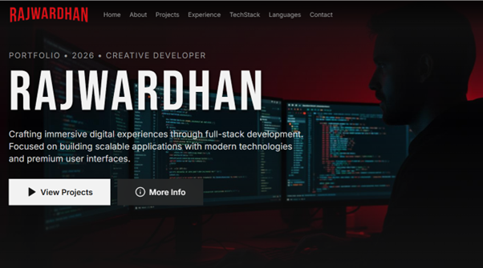

<div align="center">


# RAJWARDHAN

### Engineering stories worth shipping.

An IT Engineering student at PICT Pune building full-stack products and exploring computer vision.

<p>
	<a href="https://rajwardhan.vercel.app/"></a>
	<a href="https://rajwardhan.vercel.app/Rajwardhan_Ashok_Bhandigare.pdf"></a>
</p>

[GitHub](https://github.com/RAJWARDHAN-B) &nbsp;·&nbsp; [LinkedIn](https://linkedin.com/in/rajwardhan-bhandigare) &nbsp;·&nbsp; [Email](mailto:rajwardhanpict@gmail.com)

</div>

<p align="center">
	<a href="https://rajwardhan.vercel.app/">
		
	</a>
</p>

<div align="center">

`FULL-STACK DEVELOPMENT` &nbsp;·&nbsp; `COMPUTER VISION` &nbsp;·&nbsp; `RESEARCH`

</div>

## Featured Releases

| Title | The story | |
| --- | --- | --- |
| **Gignut** | Built and deployed a B2B platform, developing backend services and REST APIs with FastAPI. | [Watch](https://gignut.com) |
| **Solar Cell Defect Detection** | Computer vision research internship at IIT Mandi, focused on detecting and classifying photovoltaic cell defects. | Research experience |
| **Multimodal Deepfake Detection** | Published research exploring visual-audio fusion and explainable AI for media authenticity. | [Read paper](https://pijet.org/papers/volume-3%20issue-2/Final%20Revised%20Paper_Pijet-02_June26.pdf) |

## The Viewing Experience

- **Browse the catalogue:** projects, internships, publication, technologies, and languages in Netflix-inspired rows.
- **Get the details:** searchable entries open with a summary, technologies, and project link.
- **Enter another dimension:** explore selected projects in an interactive Three.js scene.
- **Get in touch:** send a message through the Formspree-powered contact form.

## On the Call Sheet

<p>
	
	
	
	
	
	
</p>

## Run the Production

```bash
cd Rajportfolio
npm install
npm run dev
```

Vite prints the local development URL. Production output is generated in `Rajportfolio/dist/` with `npm run build`.

| Command | What it does |
| --- | --- |
| `npm run build` | Build the production site |
| `npm run preview` | Preview the production build locally |
| `npm run lint` | Check the code with ESLint |
| `npm test` | Run the Vitest suite once |

<div align="center">

---

**THE END? JUST THE NEXT RELEASE.**

[Watch the portfolio](https://rajwardhan.vercel.app/) &nbsp;·&nbsp; [Connect on LinkedIn](https://linkedin.com/in/rajwardhan-bhandigare) &nbsp;·&nbsp; [Send an email](mailto:rajwardhanpict@gmail.com)

</div>
